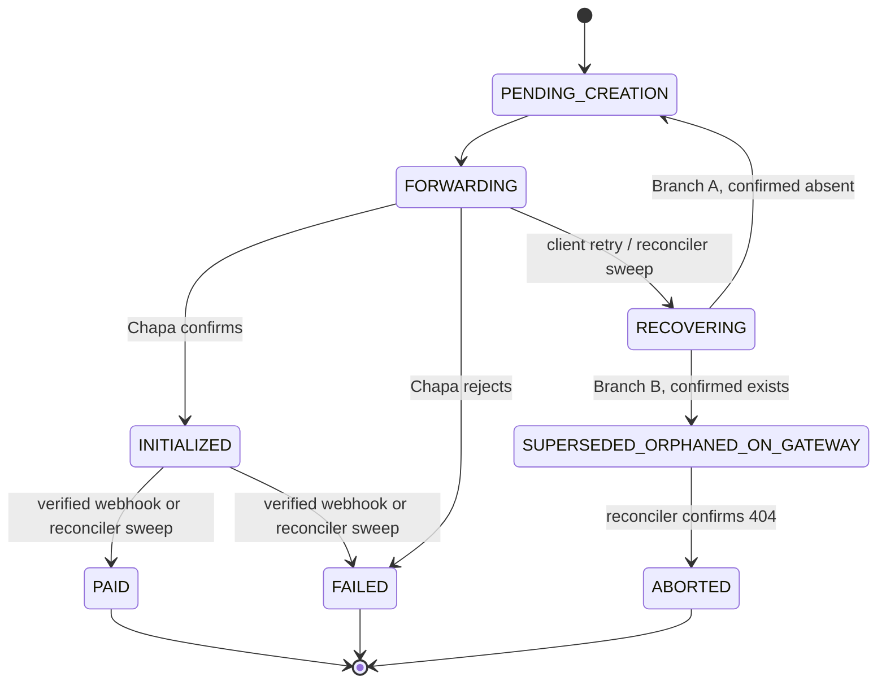

# Birtu Bridge

A resilient payment proxy gateway for [Chapa](https://chapa.co), built with Fastify and MySQL, purpose-designed to run reliably on constrained shared hosting (cPanel/Passenger).

[](https://nodejs.org)
[](https://fastify.dev)
[](https://www.mysql.com)
[](#license)
[]()

---

## Table of Contents

- [Overview](#overview)
- [Architecture at a Glance](#architecture-at-a-glance)
- [Key Guarantees](#key-guarantees)
- [Prerequisites](#prerequisites)
- [Installation](#installation)
- [Environment Variables](#environment-variables)
- [Database Setup](#database-setup)
- [Running the App](#running-the-app)
- [Background Jobs (Cron)](#background-jobs-cron)
- [API Overview](#api-overview)
- [Project Structure](#project-structure)
- [Deploying to cPanel](#deploying-to-cpanel)
- [Troubleshooting](#troubleshooting)
- [License](#license)

---

## Overview

Birtu Bridge sits between your client applications and the Chapa payment gateway. It exists to solve a specific problem: **you cannot run a native database transaction across your own database and a third-party payment API at the same time.** If your database write succeeds but the outbound call to Chapa fails (or the reverse), you end up with inconsistent state — and on shared hosting, with its recycled worker processes and low connection ceilings, that failure mode is common, not rare.

This service treats every payment as a strict state machine with write-ahead intent, backed by:

- An atomic crash-recovery mechanism that survives a process dying mid-request
- A polling reconciler that acts as the ultimate source of truth, independent of webhook delivery
- A self-healing circuit breaker so a Chapa outage can't exhaust your available worker processes
- Strict connection discipline so nothing ever holds a database connection open across a network call

## Architecture at a Glance



Every non-terminal state above is swept by a reconciler cron job, so no transaction can be silently lost even if a webhook never arrives or a worker process crashes mid-flight.

## Key Guarantees

| Concern | Mechanism |
|---|---|
| Lost webhook | Reconciler polls `INITIALIZED` transactions and re-verifies directly with Chapa |
| Crash mid-request | Atomic state claim + verify-first gate resolves the transaction on the next retry or sweep |
| Duplicate charges | Deterministic, constraint-backed idempotency on `(app_id, client_order_id, attempt_count)` |
| Connection exhaustion | No connection is ever held open across an outbound HTTP call, anywhere in the codebase |
| Forged webhooks | HMAC-SHA256 signature verification before any database access |
| Duplicate webhook delivery | Unique constraint on the inbound event reference, insert-or-noop |
| Chapa outage | Shared, database-backed circuit breaker with a self-healing probe state |
| Cron overlap | Expiring, database-backed job locks (not session-scoped `GET_LOCK`) |
| Open redirects | Pre-parse sanitization plus exact-match whitelist on registered redirect domains |

## Prerequisites

- Node.js 18 or later
- A MySQL 5.7+ / 8.x database (cPanel-provisioned or otherwise)
- A [Chapa](https://chapa.co) merchant account with a secret key and webhook secret
- `npm`

## Installation

```bash
git clone https://github.com/BirtuCan-Software/birtu-bridge.git
cd birtu-bridge
npm install
```

Copy the example environment file and fill in your own values (see [Environment Variables](#environment-variables) below):

```bash
cp .env.example .env
```

Generate a secure admin token for the `/admin` routes:

```bash
node -e "console.log(require('crypto').randomBytes(32).toString('hex'))"
```

Paste the output into `ADMIN_TOKEN` in your `.env`.

## Environment Variables

| Variable | Required | Where to get it | Notes |
|---|---|---|---|
| `NODE_ENV` | No | — | `development` or `production` |
| `PORT` | No | — | Defaults to `3000`; on cPanel this is assigned by the Node.js App Manager |
| `DB_HOST` | Yes | cPanel > MySQL Databases (usually `127.0.0.1` or `localhost` on shared hosting) | |
| `DB_PORT` | No | — | Defaults to `3306` |
| `DB_USER` | Yes | cPanel > MySQL Databases | Often prefixed, e.g. `cpaneluser_dbuser` |
| `DB_PASSWORD` | Yes | Set when creating the database user in cPanel | |
| `DB_NAME` | Yes | cPanel > MySQL Databases | Often prefixed, e.g. `cpaneluser_dbname` |
| `DB_POOL_MAX` | No | — | Keep at 5-10 on shared hosting; check your host's total connection ceiling first |
| `DB_CONNECT_TIMEOUT_MS` | No | — | Defaults to `10000` |
| `CHAPA_SECRET_KEY` | Yes | [Chapa Dashboard](https://dashboard.chapa.co) > Settings > API Keys | Use a `CHASECK_TEST-` key until you've completed the smoke test checklist |
| `CHAPA_WEBHOOK_SECRET` | Yes | Chapa Dashboard > Settings > Webhooks | Used to verify inbound webhook signatures |
| `CHAPA_API_BASE` | No | — | Defaults to `https://api.chapa.co/v1` |
| `CHAPA_TIMEOUT_MS` | No | — | Outbound call timeout; keep short (5000-8000) given limited worker processes |
| `CHAPA_WEBHOOK_SIGNATURE_HEADER` | No | Chapa Dashboard / Chapa API docs | Defaults to `Chapa-Signature`; confirm the exact header name against a real received webhook |
| `CIRCUIT_BREAKER_COOLDOWN_SECONDS` | No | — | Time before a `DEGRADED` breaker allows a probe attempt |
| `CIRCUIT_BREAKER_PROBE_STALE_SECONDS` | No | — | Time before a stuck `PROBING` state is reclaimed |
| `RECONCILER_FORWARDING_STALE_MINUTES` | No | — | How old a `FORWARDING` row must be before the reconciler sweeps it |
| `RECONCILER_RECOVERING_STALE_SECONDS` | No | — | How old a `RECOVERING` row must be before the reconciler reclaims it |
| `RECONCILER_INITIALIZED_STALE_MINUTES` | No | — | How old an `INITIALIZED` row must be before the reconciler re-verifies it |
| `JOB_LOCK_TTL_MINUTES` | No | — | Expiry for the database-backed cron lock |
| `ADMIN_TOKEN` | Yes | Generate locally (see command above) | Guards all `/admin/*` routes |
| `RATE_LIMIT_PER_MINUTE_PER_KEY` | No | — | Per-API-key request cap |
| `RATE_LIMIT_PER_MINUTE_PER_IP` | No | — | Per-IP cap, used for unauthenticated/invalid-key requests |
| `PUBLIC_BASE_URL` | Yes | Your deployed domain | Used to construct the Chapa `callback_url`; must be publicly reachable in production |
| `DELIVERY_MAX_ATTEMPTS` | No | — | Max retries before a webhook delivery job moves to the dead-letter queue |
| `DELIVERY_BACKOFF_BASE_SECONDS` | No | — | Base for exponential backoff between delivery retries |
| `DELIVERY_TIMEOUT_MS` | No | — | Timeout for outbound delivery calls to client app webhook URLs |
| `ALERT_EMAIL_TO` | No | Your own email address | Destination for the DLQ digest alert email |
| `ALERT_EMAIL_FROM` | No | — | From-address for digest emails, sent via local sendmail |

Do not commit your real `.env` file. Only `.env.example` should be tracked in version control.

## Database Setup

Run the migration runner once your `.env` database credentials are in place:

```bash
npm run migrate
```

This creates all required tables and records applied migrations in `schema_migrations`, so re-running the command is always safe and will only apply new migrations going forward.

## Running the App

Development, with auto-reload:

```bash
npm run dev
```

Production:

```bash
npm start
```

Confirm the service is up and can reach the database:

```bash
curl http://localhost:3000/health
```

Expected response:

```json
{"status":"ok","db":"connected"}
```

## Background Jobs (Cron)

Three scripts must run on a schedule for the system to be fully self-healing. Locally you can invoke them manually; in production these belong in cron (see [Deploying to cPanel](#deploying-to-cpanel)).

| Script | Command | Suggested interval | Purpose |
|---|---|---|---|
| Reconciler | `npm run reconcile` | Every 2-5 minutes | Sweeps every non-terminal transaction state and resolves it against Chapa directly |
| Delivery worker | `npm run deliver` | Every 1 minute | Delivers queued webhook notifications to client apps, with backoff and DLQ |
| DLQ digest | `npm run digest` | Every 1 hour | Sends a single aggregated email for any delivery failures since the last digest |

All three scripts self-lock via a database-backed, expiring lock table, so overlapping cron invocations exit cleanly rather than double-processing.

## API Overview

All application-facing routes require `Authorization: Bearer <api_key>`. Admin routes require `x-admin-token: <ADMIN_TOKEN>`.

| Method | Path | Purpose |
|---|---|---|
| `GET` | `/health` | Service and database health check |
| `POST` | `/admin/applications` | Register a new client application |
| `POST` | `/admin/applications/:appId/api-keys` | Issue a new API key (shown once) |
| `POST` | `/admin/applications/:appId/api-keys/:keyId/revoke` | Revoke an API key |
| `POST` | `/admin/applications/:appId/redirect-whitelist` | Register an allowed redirect domain |
| `PATCH` | `/admin/applications/:appId/webhook-url` | Set the downstream delivery URL for an application |
| `POST` | `/v1/transactions/initialize` | Initialize a payment; idempotent per `clientOrderId` |
| `POST` | `/v1/webhooks/chapa` | Inbound webhook receiver (called by Chapa, not by client apps) |

## Project Structure

```
birtu-bridge/
├── app.js                     # cPanel/Passenger entry point
├── migrations/                # Versioned SQL schema migrations
├── scripts/
│   ├── migrate.js
│   ├── run-reconciler.js
│   ├── run-delivery-worker.js
│   └── run-dlq-digest.js
├── src/
│   ├── clients/                # Chapa HTTP client
│   ├── config/                 # Environment-driven configuration
│   ├── db/                     # Shared MySQL connection pool
│   ├── middleware/              # Auth and gateway-entry hooks
│   ├── repositories/            # Database access layer
│   ├── routes/                  # Fastify route definitions
│   ├── services/                # Business logic and state machine
│   ├── utils/                   # Crypto, sleep, mailer helpers
│   └── server.js                 # Fastify app definition and bootstrap
├── .env.example
└── package.json
```

## Deploying to cPanel

1. Push this repository to your cPanel account, either via Git Version Control (using the included `.cpanel.yml`) or by uploading the files directly.
2. In cPanel's **Setup Node.js App**, create an application pointing its startup file at `app.js`, using Node.js 18 or later.
3. Add every variable from the [Environment Variables](#environment-variables) table in the app's environment variable panel — cPanel manages these independently of any `.env` file on disk.
4. Activate the app's virtual environment and run the install and migration commands once:
   ```bash
   source /home/USERNAME/nodevenv/birtu-bridge/18/bin/activate && cd /home/USERNAME/birtu-bridge
   npm install --omit=dev
   npm run migrate
   ```
5. Restart the application from the Node.js App Manager.
6. Set your Chapa webhook callback URL to `https://your-domain.com/v1/webhooks/chapa`.
7. Add the three background jobs from the [Background Jobs](#background-jobs-cron) table as cron jobs, each using the same `nodevenv` activation prefix.

## Troubleshooting

**`/health` returns a database error.** Double-check `DB_HOST`, `DB_USER`, `DB_PASSWORD`, and `DB_NAME` against the exact values shown in cPanel's MySQL Databases panel — shared hosting frequently requires the full prefixed username and database name rather than a plain name.

**Webhook signature verification always fails.** Confirm `CHAPA_WEBHOOK_SIGNATURE_HEADER` matches the actual header name Chapa sends — inspect a real received webhook's headers if unsure, and confirm `CHAPA_WEBHOOK_SECRET` matches exactly what's shown in the Chapa dashboard.

**Cron jobs appear to do nothing.** Check the log files configured in your cron command for errors, and confirm the `nodevenv` activation path matches exactly what the Node.js App Manager screen shows for your app, including the Node version number in the path.

**A transaction seems stuck.** The reconciler resolves stuck states on its own schedule; you can also invoke `npm run reconcile` manually to force an immediate sweep.

## License

UNLICENSED — internal/proprietary project. Update this section if you intend to open-source or license the repository differently.